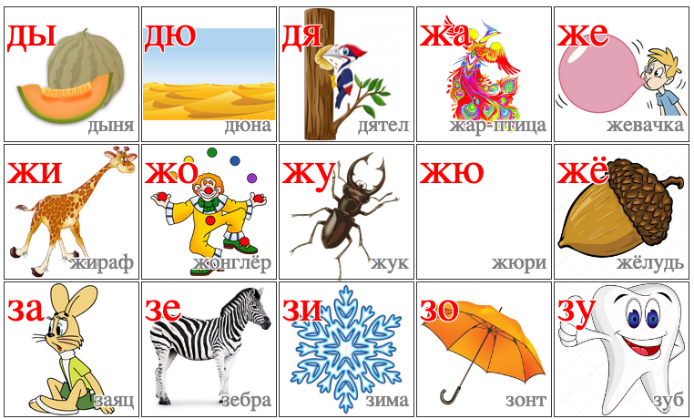

# balbes

Generate tables for teaching elementary reading skills.

## What

Here's an example of what the output could look like:



The generator outputs HTML.
I typically use Firefox to print the HTML to PDF, then physically print that to paper.

## How

```bash
sort -k1,1 text1.txt | python maketable.py > table1.html
```

The [text1.txt](text1.txt) file contains text to put into the table.
It looks like this:

```
ба бабушка
бе белка
би бита
бо босс
бу бульдозер
бэ бэби
га гайка
ге гена
гё гёдза
ги гитара
го горка
```

In this case, it contains Russian [bigrams](https://en.wikipedia.org/wiki/Bigram) in the first column, and a word starting with the bigram in the second column.
If you don't like my list of bigrams, you can generate your own using [gen1.py](gen1.py) or create it manually.

The script will look for images in the img subdirectory.
It will look for the actual word (without the extension).
So, for the above example, the image files would be:

```
img/бабушка.jpeg
img/белка.gif
img/бита.webm
```

and so on.
The image format does not matter, as long as the browser can display it natively.

I don't distribute the actual images here because some of them may be copyright.
You can gather the images yourself using the [imagesearch.py](imagesearch.py) script.
Feed it your list of words, and it will hit [DuckDuckGo](https://duckduckgo.com) for each word one by one.
Pick the result you like, and save it to the img subdirectory.
If you have [pyperclip](https://pypi.org/project/pyperclip/) installed, the script will copy the filename (minus the extension) to the buffer for you, so you can paste it when needed.

## How does it work?

The tables are regular [HTML](https://en.wikipedia.org/wiki/HTML).
[CSS](https://en.wikipedia.org/wiki/CSS) handles the appearance, so things like overlaying the text over the images, text outlines, etc.
Finally, [Python](https://www.python.org) ties everything together.

I was originally going to use something like [PIL](https://pypi.org/project/PIL/) to tweak the images prior to putting them on the page.
Surprisingly, I found that CSS handles that via [transforms](https://www.w3schools.com/cssref/css3_pr_transform.asp), e.g. scale, translate and mirror images.

## Why?

I've found that tables like this help my kid learn to read.
They are similar to the [syllabary tables](https://files.tofugu.com/articles/japanese/2016-04-05-hiragana-chart/kidsmoji1.jpg) used to teach Japanese.
